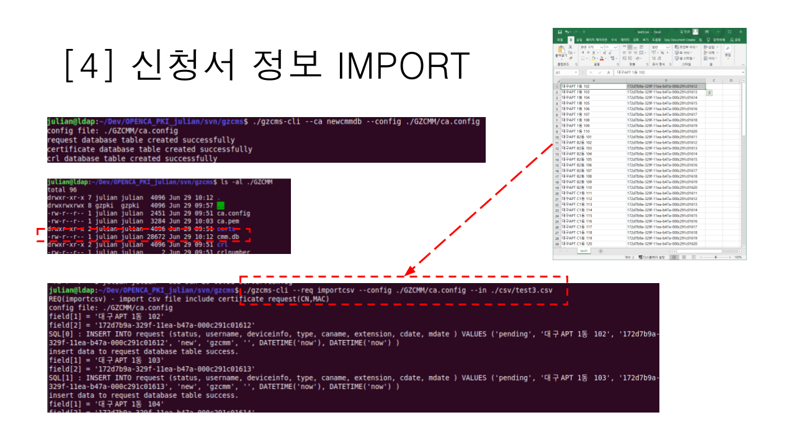
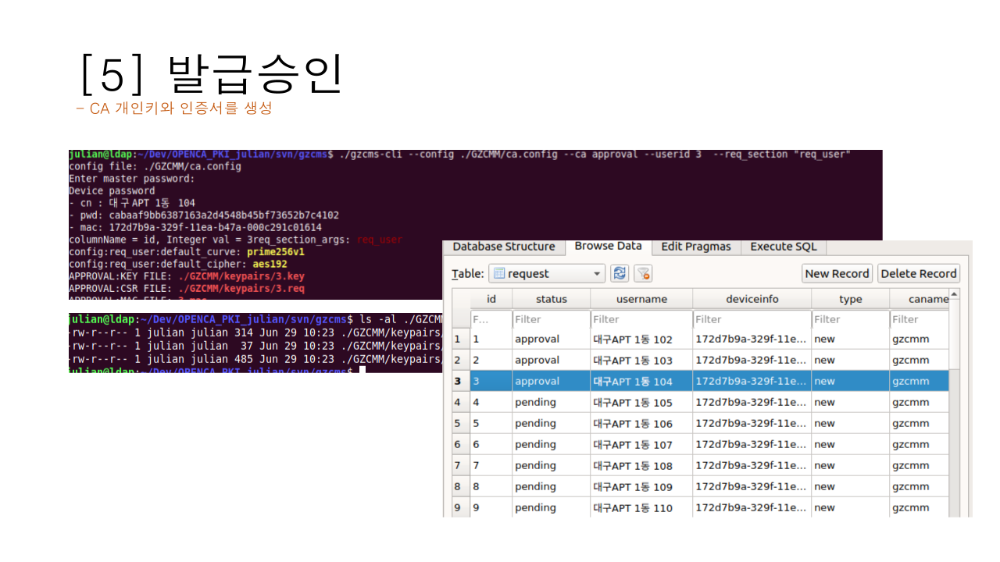
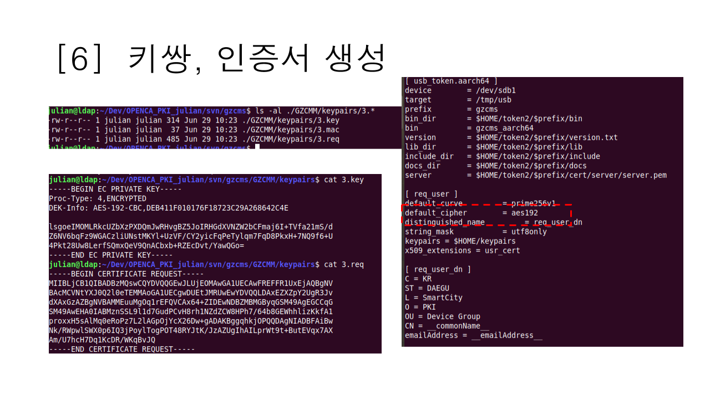
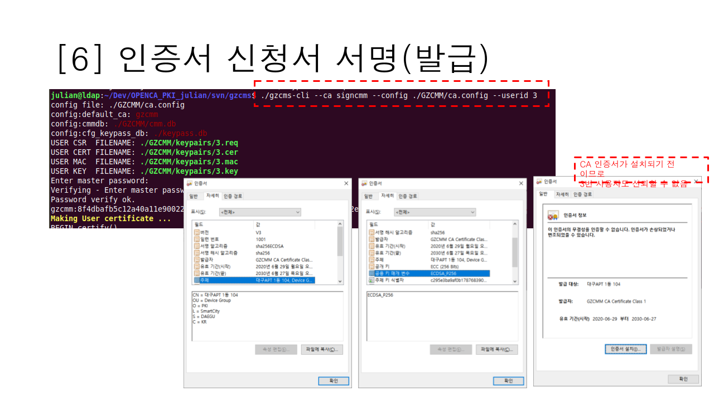
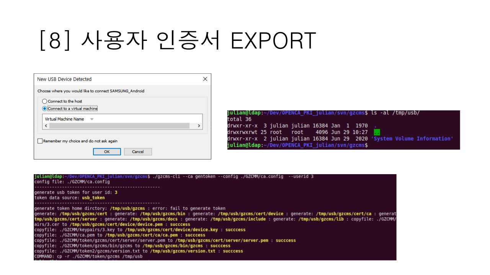
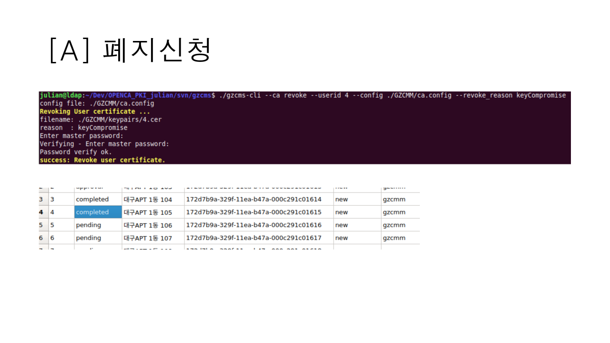
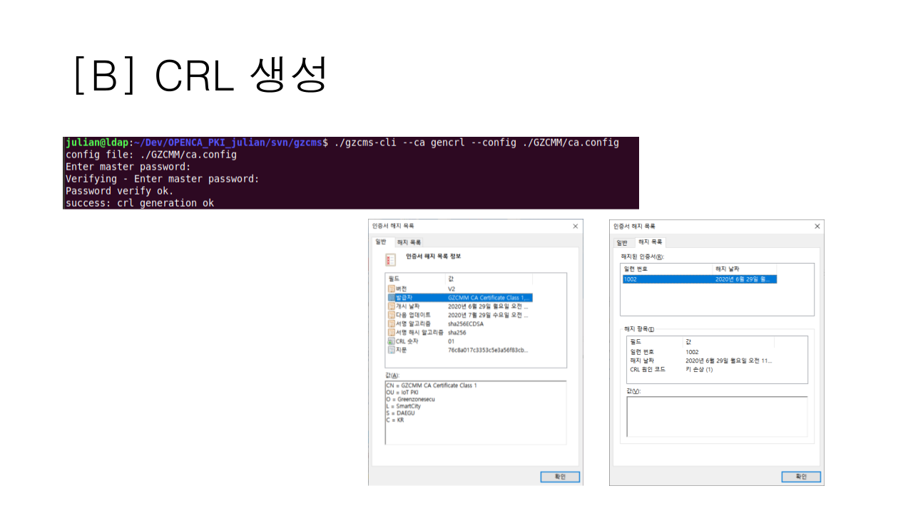
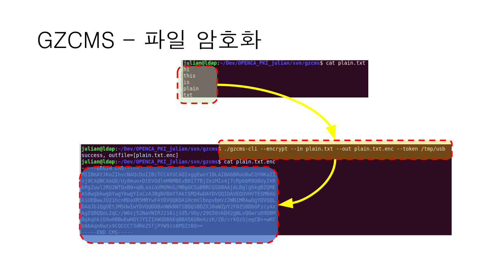
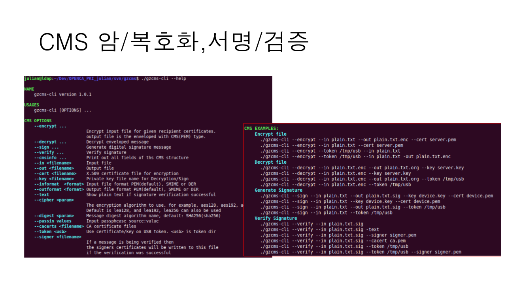
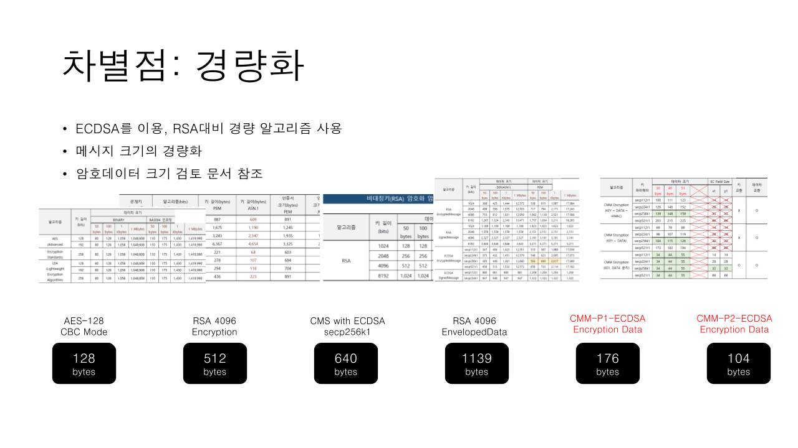

# Security Lib/Tool for SmartCity - IoT Smart Home

Lib/Tools include cms, cms-cli, pki lib 

GZCMM은 IoT 환경에서 보안 라이브러리 및 관리 도구로
- 자동화 : 패스프레이즈의 자동 생성
- 확장성 : IoT장비추가에 자유로운 구성
- 관리용이성 : 관리자/사용자 도구 제공 및 키관리도구/라이브러리(keypass) 제공
- 효율성 : LoRA망과 같이 전송량이 제한된 환경에서 최소한의 페이로그만으로 암호화 제공
에 촛점을 맞추어 개발된 PKI(Public Key Infrastructure) 기반의 경량 암호화 도구로
- 사용자(디바이스)와 서버 간 키 공유
- 디바이스간 키 교환의 최소화
에 중점을 두고 개발된 라이브러리 입니다.
 

## GZCMM Life Cycle
- 초기 환경 설정
- 인증서 신청
- 인증서 발급
- 인증서 폐지
의 생명 주기를 가지며, 
- 인증서 빌급/관리도구(gzcmm)
- 사용자 툴(gczms-cli)
를 제공합니다. 

## GZCMM CA 설정
- gzcmm의 라이프사이클은 인증 기관(CA)의 설정에서 시작됩니다. 
- CA 설정을 통해 인증서 관리자는 인증서를 발급/폐지할 수 있읍니다
> Note : 인증기관 개인키와 개인키 페스프레이즈는 보안의 가장 핵심 정보이므로 절대 외부에 노출되어서는 안된다. 

 

## GZCMM keypass 라이브러리
- 키패스(keypass) 라이브러리는 하나의 마스터 패스워드만으로 다양한 개인키를 관리할 수 있는 라이브러리입니다
- 다중 CA환경에서 각 개인키는 강력한 난수 기반 패스워드로 암호화됩니다
- 키 패스를 이용 패스워드들은 마스터키로 복호화할 수 있는 형태로 생성할 수 있으며 
- 결과적으로 키 관리의 어려움을 크게 줄 일 수 있습니다. 

 

## CA KEYID 생성
- CA키 쌍을 생성하기 전에 CA키와 대응되는 keyid를 생성한다.
- gzcms-cli(또는 gzcmm) keypass 명령을 이용하여 keyid를 만든다.
- gzcms-cli --keypass list 명령을 이용하여 keyid가 생성되었는지 확인 가능하다. 

 

## CA 설정(CA_DIR)
인증서 발급을 위해서 인증서 발급 기관(CA) 설정이 필요하다.
- gzcms-cli(또는 gzcmm) --ca newcadir 명령어를 이용하여 CA 기본 구조를 생성한다. 
- 인증서 발급에 필요한 기본 정책과 파일등이 생성된다.

  

## CA 키 쌍 생성(NEWCA)
실제 CA키 쌍을 생성한다.
- gzcms-cli(또는 gzcmm) --ca newca 명령을 이용한다. 사용자 인증서 발급을 위한 인증기관의 키 쌍을 생성한다. 

  

## 인증서 신청서 불러오기(IMPORT)
GZCMM은 CSV 형식의 인증서 신청서를 불러오는 것이 가능하다
- gzcms-cli(또는 gzcmm) --req importcsv 명령을 이용한다. 
- csv형식의 인증서 신청서는 대량의 인증서 신청을 한번에 처리하는 경우 유용하며, 인증서와 사용자 개인키를 인증기관에서 동시에 생성한다. 

   

## 인증서 발급 승인(APPROVAL)
CSV 형식의 인증서 신청서를 불러온 후 발급 승인으로 상태를 변경한다.
- 발급 승인은 ./gzcms-cli --ca approval --userid <USERID> ... 를 이용하여 승인 가능하다. 
- --reqsection <SEC> 옵션을 이용하여 인증서 신청서 생성 옵션을 지정한다. 일반적으로 서버인증서인지 사용자 인증서인지 구분하여 발급하는데 유용하다. 

   

> 발급승인의 결과물은 '인증서'가 아니라 개인키 + 인증서신청서이다. 
  
## 인증서 발급 승인(APPROVAL) - 키쌍 생성
- 발급승인의 결과물인 개인키 + 인증서신청서 확인

   

  
## 인증서 발급 (SIGNCMM)
- 실제 인증서가 생성된다. CA 키 쌍을 이용한 서명을 수행한다.
- ./gzcms-cli --ca signcmm --userid <ID> --config <CFG_FILE>

   

## 인증서 내보내기 (EXPORT)
- 사용자 인증서를 USB로 내보낸다. 생성된 USB는 특정 디바이스에서만 이용할 수 있도록 암호화 되어 있다. 
- ./gzcms-cli --ca gentoken 명령을 이용한다. 

   

  
## 인증서 폐지 신청(REVOKE)
- 사용자 인증서를 폐지(revoked) 상태로 변경한다. 실제 CRL포함되지는 않으며, 폐지 상태 인증서는 폐지목록 생성 시 일괄적으로 CRL에 추가된다
- ./gzcms-cli --ca revoke --usrid <ID> 명령을 이용한다. 
- 폐지 사유를 추가하는 경우 "revoke_reason" 옵션을 이용한다. 

   

  
## 인증서 폐지목록 - CRL 생성(GENCRL)
- 폐지(revoked) 상태 인증서를 이용 CRL을 생성하고 CA 개인키로 서명한다. 
- ./gzcms-cli --ca gencrl 명령을 이용한다. 

   

  
  
# CMS Encrypt/Decrypt for IoT Smart Home
  
## 파일 암호화
- gzcms-cli는 CMS(Cryptographic Message Syntax) 형식의 암호화/서명 데이터를 생성할 수 있다.
- gzcmm은 기본적으로 인증서/개인키 쌍을 이용한 EnvelopedMessage 형식의 암호문을 생성한다. 

   

  
## GZCMM 이용한 암호/서명
- gzcms-cli 명령을 이용하여 SignedData, EnvelopedData를 생성, 검증/복호화, 파싱(parsing)하는 것이 가능하다
- 사용법은 gzcms-cli --help명령을 통해 확인 가능하다.

   

  
  
# ECCPx Encrypt/Decrypt for IoT Smart Home
  
## ECC 파일 암호화  
- ECCP1/P2 암호화는 데이터 전송 대역폭이 극히 작은 환경에서도 데이터의 암호화가 가능하도록 하는 그린존시큐리티의 암호화 라이브러리이다.
- ECCP1/2는 특허 기술로 공개키 암호화 기술을 사용하면서 동시에 원본 데이터 + 4바이트의 페이로드만을 추가로 사용한다. 
- LoRA와 같이 네트워크 환경이 극단적인 경우에도 공개키 암호화가 가능하다. 

   

  

  

