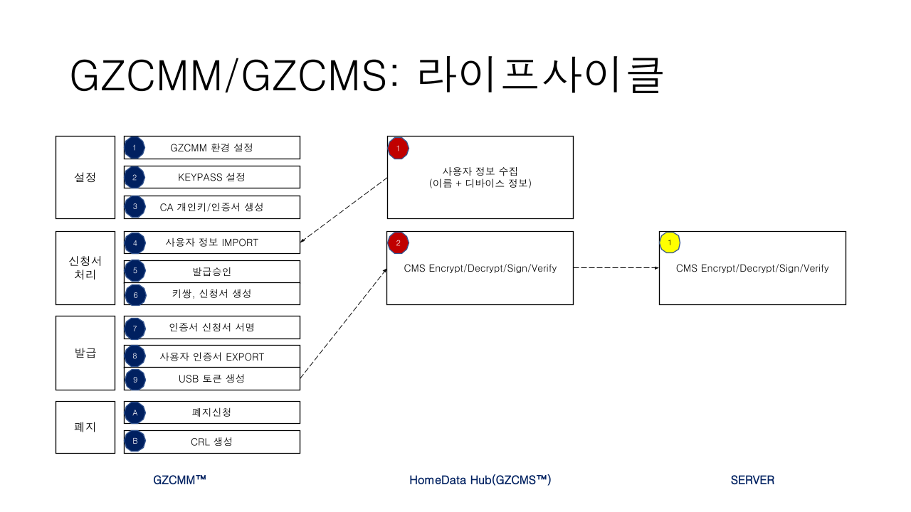
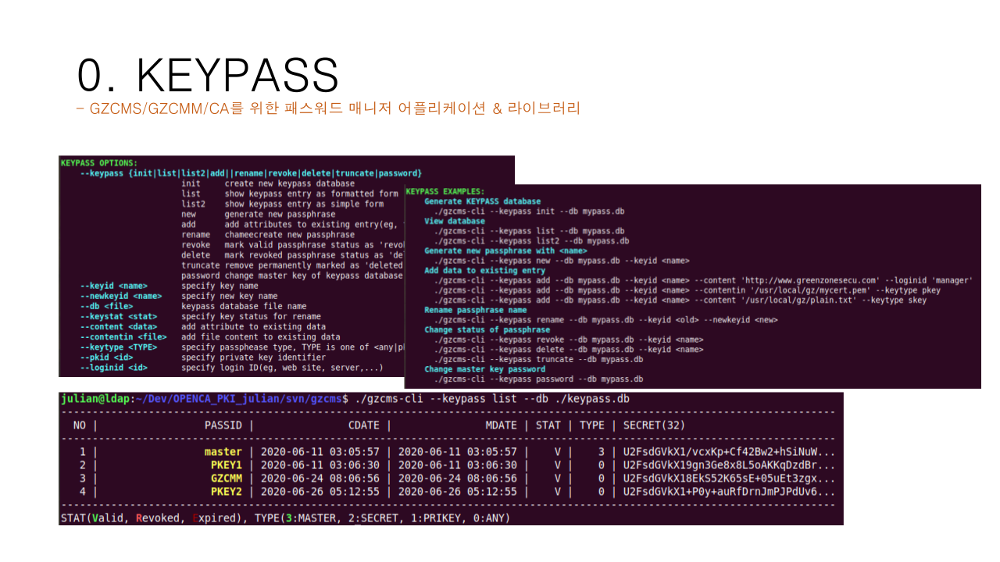
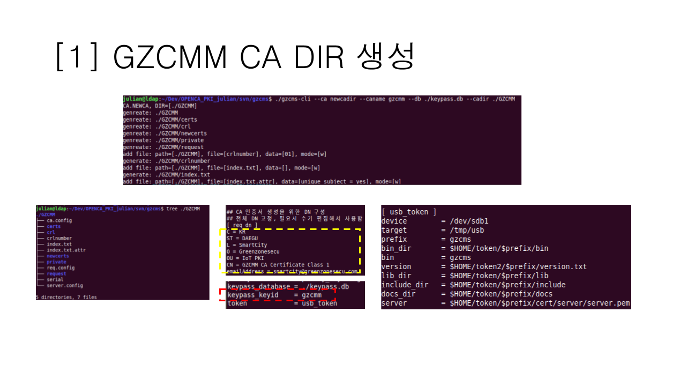
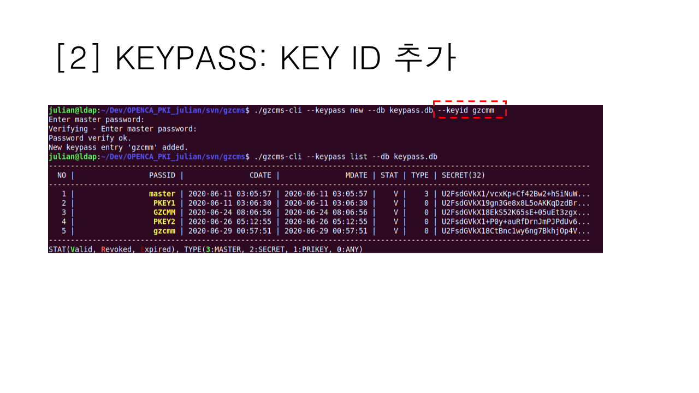
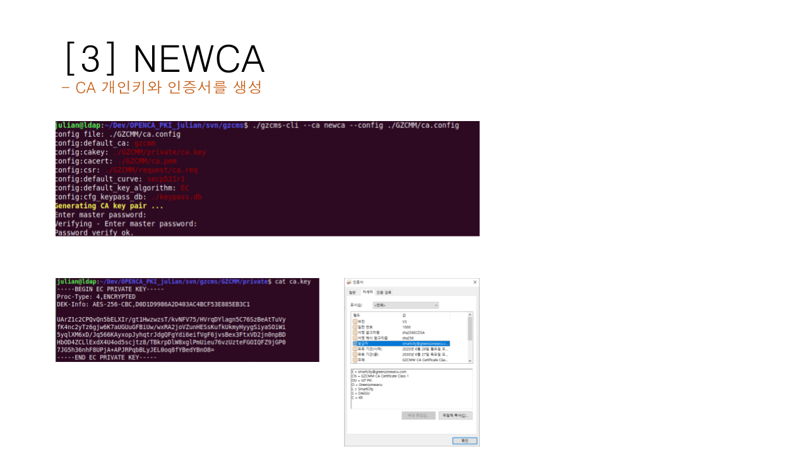

# simplicity
# Security Lib/Tool for SmartCity - IoT Smart Home

simplicity include cms, cms-cli, pki lib 

GZCMM은 IoT 환경에서 보안 라이브러리 및 관리 도구로
- 자동화 : 패스프레이즈의 자동 생성
- 확장성 : IoT장비추가에 자유로운 구성
- 관리용이성 : 관리자/사용자 도구 제공 및 키관리도구/라이브러리(keypass) 제공
- 효율성 : LoRA망과 같이 전송량이 제한된 환경에서 최소한의 페이로그만으로 암호화 제공
에 촛점을 맞추어 개발된 PKI(Public Key Infrastructure) 기반의 경량 암호화 도구로
- 사용자(디바이스)와 서버 간 키 공유
- 디바이스간 키 교환의 최소화
에 중점을 두고 개발된 라이브러리 입니다.
 

## GZCMM Life Cycle
- 초기 환경 설정
- 인증서 신청
- 인증서 발급
- 인증서 폐지
의 생명 주기를 가지며, 
- 인증서 빌급/관리도구(gzcmm)
- 사용자 툴(gczms-cli)
를 제공합니다. 

## GZCMM CA 설정
- gzcmm의 라이프사이클은 인증 기관(CA)의 설정에서 시작됩니다. 
- CA 설정을 통해 인증서 관리자는 인증서를 발급/폐지할 수 있읍니다
> Note : 인증기관 개인키와 개인키 페스프레이즈는 보안의 가장 핵심 정보이므로 절대 외부에 노출되어서는 안된다. 

 

## GZCMM keypass 라이브러리
- 키패스(keypass) 라이브러리는 하나의 마스터 패스워드만으로 다양한 개인키를 관리할 수 있는 라이브러리입니다
- 다중 CA환경에서 각 개인키는 강력한 난수 기반 패스워드로 암호화됩니다
- 키 패스를 이용 패스워드들은 마스터키로 복호화할 수 있는 형태로 생성할 수 있으며 
- 결과적으로 키 관리의 어려움을 크게 줄 일 수 있습니다. 

   

## CA 설정(CA_DIR)
인증서 발급을 위해서 인증서 발급 기관(CA) 설정이 필요하다.
- gzcms-cli(또는 gzcmm) 명령어를 이용하여 CA를 생성한다. 
- CA키 쌍을 생성하기 전에 CA키와 대응되는 keyid를 생성한다.
- gzcms-cli(또는 gzcmm) keypass 명령을 이용하여 keyid를 만든다.
- gzcms-cli --keypass list 명령을 이용하여 keyid가 생성되었는지 확인 가능하다. 

   

   

## CA 키 쌍 생성(NEWCA)
실제 CA키 쌍을 생성한다.
- gzcms-cli(또는 gzcmm) --ca newca 명령을 이용한다. 

   

